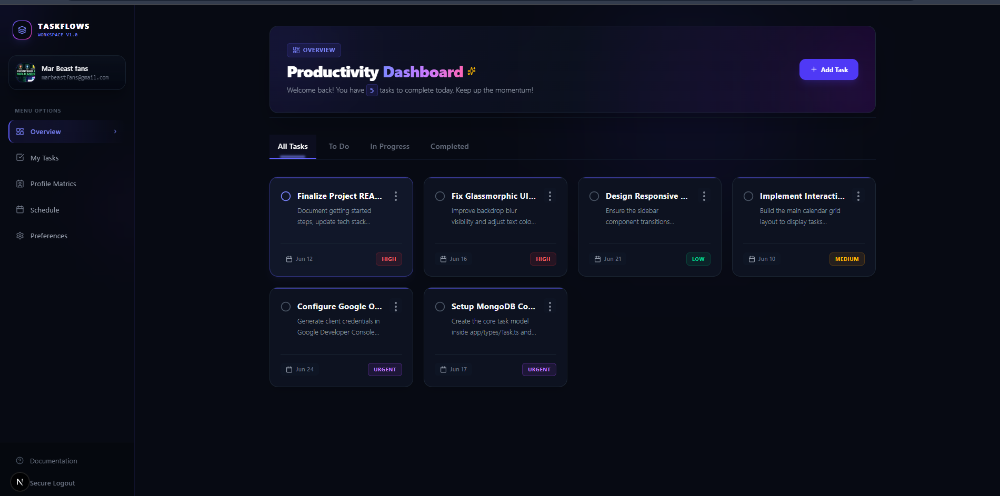

# 🚀 Full-Stack Next.js Project (TaskFlows Dashboard)


---

## 📖 About

**TaskFlows** is a modern full-stack productivity and task management workspace built with:

- Next.js App Router
- React
- TypeScript
- MongoDB Atlas

It includes authentication, task management, analytics, and a responsive UI.

---

## ✨ Features

- 🔒 Google OAuth 2.0 Authentication (NextAuth.js)
- 📊 Task Analytics Dashboard
- 🗂️ Dynamic Filtering (All / To Do / In Progress / Completed)
- 📅 Calendar Scheduling System
- ⚡ Priority System (Urgent / High / Medium / Low)
- 📱 Responsive Mobile Sidebar
- 🔐 Secure Server Actions (Next.js)

---

## 🛠️ Tech Stack

- Next.js 15
- React 19
- TypeScript
- Tailwind CSS
- NextAuth.js
- MongoDB Atlas (Mongoose)
- Lucide React Icons

---

<p align="center">
  
</p>
## 📂 Project Structure

```bash
├── app/
│   ├── dashboard/
│   ├── types/
│   │   └── Task.ts
│   ├── form/
│   │   └── (tasks)/actions.ts
│   ├── api/
│   │   └── auth/
│   └── page.tsx
│
├── components/
│   ├── Sidebar.tsx
│   ├── FilterTabs.tsx
│   └── TaskList.tsx
│
├── public/
├── package.json
└── README.md
```

---

## 🚀 Getting Started

### 1️⃣ Clone Repository

```bash
git clone https://github.com/your-username/task-flow-next-js.git
cd task-flow-next-js
```

### 2️⃣ Install Dependencies

```bash
npm install
```

### 3️⃣ Create `.env.local`

```env
MONGODB_URI=your_mongodb_connection_string_here

GOOGLE_CLIENT_ID=your_google_client_id_here
GOOGLE_CLIENT_SECRET=your_google_client_secret_here

NEXTAUTH_SECRET=your_nextauth_secret_here
NEXTAUTH_URL=http://localhost:3000
```

---

## ▶️ Run Development Server

```bash
npm run dev
```

Open your browser and visit:

```text
http://localhost:3000
```

---

## 🏗️ Build for Production

```bash
npm run build
npm start
```

---

## 🌐 Deployment (Vercel)

1. Push project to GitHub
2. Import repository into Vercel
3. Add all environment variables
4. Update `NEXTAUTH_URL` with your production domain

Example:

```env
NEXTAUTH_URL=https://your-domain.vercel.app
```

---
🔗 Live Demo: https://task-flow-next-js-pied.vercel.app/

---
## 📄 License

MIT License © 2026